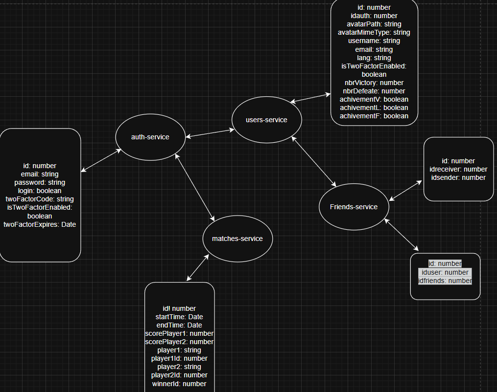

*This project has been created as part of the 42 curriculum by jguaglio, klabaune, lhabrial, taomalbe.*

# Transcendance

## Description

**Transcendance** is a full-stack web application centered around a real-time multiplayer **Pong game**. The project aims to recreate and extend the classic Pong experience into a modern online platform with user accounts, profiles, friends, tournaments, and an AI opponent.

Users can register, log in securely, manage their profiles, add friends, and play Pong matches either against other players or against an AI. Competitive features such as tournaments and match tracking enhance the gameplay experience.

This project was developed as a team as part of the Common Core project at 42.


## Instructions

### Prerequisites

The following tools are required to run the project:

* Docker
* Docker Compose
* Git
* A modern web browser (Google Chrome – latest stable version)

### Environment Setup

1. Clone the repository:

```bash
git clone <repository_url> transcendance
cd transcendance
```

2. Create environment files:

```bash
cp .env.example .env
```

### Run the Project

Start the entire application using Docker Compose:

```bash
docker-compose up --build
```

or

```bash
make
```

This single command will:

* Build and start the frontend
* Launch all backend microservices
* Initialize SQLite databases via Docker volumes

Once running, the application will be accessible through your browser.

To stop the project:

```bash
docker-compose down
```

or

```bash
make down
```


## Team Information

### Team Members & Roles

* **jguaglio**

  * Roles: Product Owner, Technical Lead, Developer
  * Responsibilities:

    * Defined the global product vision
    * Made architectural and technical decisions
    * Reviewed critical code and ensured code quality
    * Contributed to backend and core game logic

* **taomalbe**

  * Roles: Project Manager, Developer
  * Responsibilities:

    * Organized team workflow and planning
    * Tracked progress and deadlines
    * Ensured team communication
    * Contributed to feature development

* **lhabrial**

  * Role: Developer
  * Responsibilities:

    * Write code for assigned features.
	* Participate in code reviews.
	* Test their implementations.

* **klabaune**

  * Role: Developer
  * Responsibilities:

	* Write code for assigned features.
	* Participate in code reviews.
	* Test their implementations.


## Project Management

### Organization

The project was developed collaboratively with clear role distribution from the start. Tasks were divided based on complexity and relevance to each member’s role.

### Tools Used

* **Git & GitHub**: Collaboration
* **Discord**: Communication and quick problem-solving
* **Todoist**: Task management

### Workflow

* Regular meetings to synchronize progress
* Feature-based task assignment
* Code reviews for important changes


## Technical Stack

### Frontend

* **React** – Component-based UI framework
* **TypeScript** – Strong typing and improved maintainability
* **Tailwind CSS** – Utility-first styling and responsive design

### Backend

* **Node.js** microservices architecture
* Multiple independent services (auth, users, friends, matches)
* RESTful APIs for inter-service and frontend communication

### Database

* **SQLite**
* One database per microservice
* Simple, reliable relational storage suitable for containerized environments

### DevOps

* **Docker & Docker Compose**
* Containerized frontend and backend services
* Persistent volumes for databases
* Single-command deployment

### Justification of Technical Choices

* Microservices improve scalability and separation of concerns
* Docker ensures reproducibility and easy deployment
* React + TypeScript offers a modern and maintainable frontend
* SQLite provides simplicity while remaining fully relational


## Database Schema



We chose this database system because we used the microservices module, which required us to separate the different services and, consequently, their respective databases. Each database therefore corresponds to the specific needs of its service.

For example, the user-service stores all user-related data, while the auth-service contains all authentication-related information. 


## Features List

* User authentication (register/login/logout)
* User profiles with avatar
* Friends system (add/remove friends)
* Online Pong game (real-time)
* AI opponent
* Tournament system


### Modules

### Selected Modules & Points

| Module                                                | Type  | Contributors                           | Points |
| ----------------------------------------------------- | ----- | -------------------------------------- | ------ |
| Use a framework for both frontend and backend         | Major | klabaune, lhabrial, taomalbe, jguaglio | 2      |
| Standard user management and authentication (friends) | Major | jguaglio                               | 2      |
| Complete 2FA system                                   | Minor | jguaglio                               | 1      |
| Introduce AI Opponent                                 | Major | taomalbe                               | 2      |
| Web-based game (play against each other)              | Major | taomalbe, jguaglio                     | 2      |
| Tournament system                                     | Minor | klabaune, taomalbe                     | 1      |
| Backend as microservices                              | Major | jguaglio, taomalbe                     | 2      |
| Infrastructure for log management using ELK           | Major | jguaglio                               | 2      |
| Use an ORM for the database                           | Minor | jguaglio, taomalbe                     | 1      |
| Notification system                                   | Minor | lhabrial                               | 1      |
| Support for additional browsers                       | Minor | lhabrial, klabaune                     | 1      |
| Custom-made design system                             | Minor | lhabrial, klabaune, taomalbe, jguaglio | 1      |
| Game statistics and match history                     | Minor | taomalbe                               | 1      |
| Support for multiple languages (at least 3 languages) | Minor | jguaglio                               | 1      |
| A gamification system                                 | Minor | taomalbe                               | 1      |

**Total points: 22**

### Module Implementation & Justification

* **Frontend & Backend Frameworks**: Ensures modern, maintainable architecture for the whole application.
* **User Management & Authentication**: Core to support profiles, friends, and secure logins.
* **2FA**: Adds an extra security layer for users.
* **AI Opponent**: Provides engaging gameplay for single-player matches.
* **Web-based Game & Multiplayer**: Allows real-time gameplay against other users.
* **Tournament System**: Enables competitive features and ranking.
* **Microservices Backend**: Ensures scalability, separation of concerns, and easy maintenance.
* **ELK Log Management**: Supports monitoring and debugging in production.
* **ORM for Database**: Simplifies database operations and ensures maintainability.
* **Notification System**: Informs users of game events and interactions.
* **Additional Browser Support**: Improves accessibility across multiple browsers.
* **Custom Design System**: Standardizes UI components for consistency.
* **Game Statistics & Match History**: Tracks user performance and engagement.
* **Support for Multiple Languages**: Implements 3 languages (french, english and spanish) with an i18n system to make the platform accessible to a wider audience.
* **Gamification system**: Implements persistent user rewards such as achievements, progression levels, and leaderboards to increase user engagement.

## Individual Contributions

Jguaglio was responsible for the entire backend, including the user management module and all backend-related components.

Taomalbe handled the Pong game and the tournament system, both on the frontend side and the corresponding backend microservice.

Lhabrial and Klabaune worked on the website’s frontend and design.


## Resources

* React [Documentation](https://react.dev/learn)
* Node.js [Documentation](https://nodejs.org/docs/latest/api/)
* Docker [Documentation](https://docs.docker.com/)
* SQLite [Documentation](https://sqlite.org/docs.html)
* Tailwind CSS [Documentation](https://v2.tailwindcss.com/docs)
* Styling with utility classes [Documentation](https://tailwindcss.com/docs/styling-with-utility-classes)

### AI Usage

AI tools were used to:

* Assist with documentation structure
* Generate ideas for feature organization
* Help for visual design


## License

This project is developed for educational purposes as part of the 42 curriculum.
